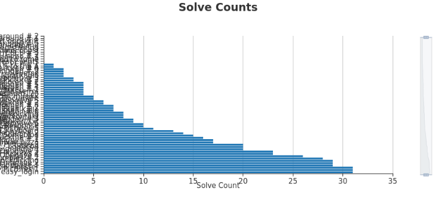
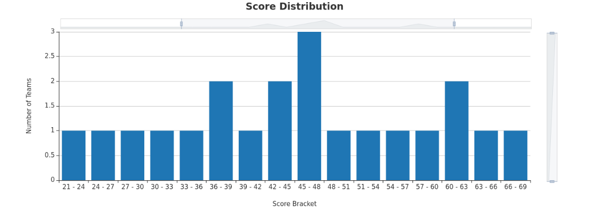
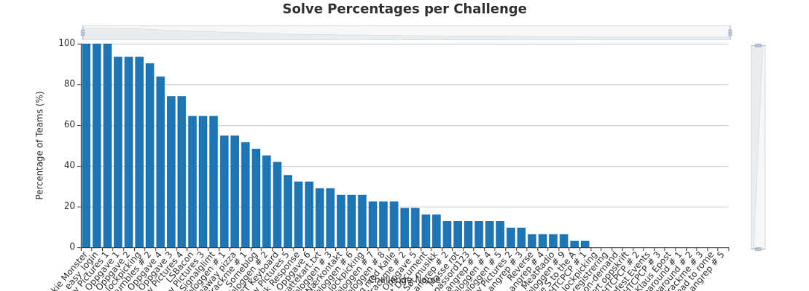
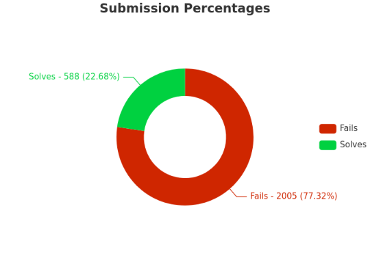
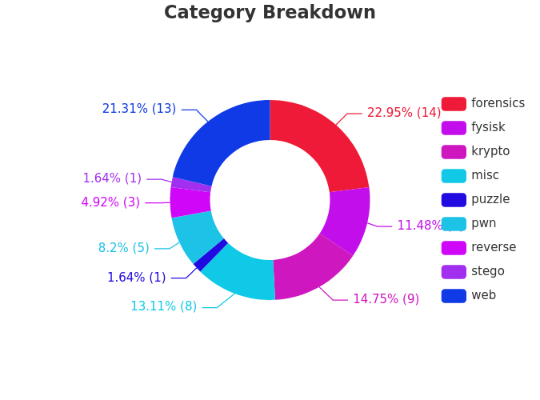

# 2022 - CTF

## TSOC CTF 
> TSOC Søker deltids ansatte send mail til henrik.buksholt@telenor.no om du er intressert :) 

- **86** users registered
- **34** teams registered
- **76** IP addresses
- **216** total possible points
- **61** challenges
- **easy_login** has the most solves with 31 solves
- **R to the S to the A** has the least solves with 1 solves

### Teams

| Place | Team                       | Score |
| ----- | -------------------------- | ----- |
| 1     | Team 3                     | 121   |
| 2     | fortsatt student           | 119   |
| 3     | 0x626F797361               | 85    |
| 4     | Team in The Middle         | 82    |
| 5     | De håpfulle                | 73    |
| 6     | Tres Plebis                | 68    |
| 7     | CCG                        | 63    |
| 8     | Brøytekantene              | 61    |
| 9     | Dumt Vinnerlag             | 60    |
| 10    | Nextgentel                 | 59    |
| 11    | DeepWaterShallowMinds      | 58    |
| 12    | schmein                    | 50    |
| 13    | Set Sail For Fail          | 48    |
| 14    | To og førti                | 48    |
| 15    | SQL deez nuts              | 46    |
| 16    | aprikos                    | 45    |
| 17    | We tried                   | 44    |
| 18    | Juice                      | 40    |
| 19    | achernar                   | 39    |
| 20    | IKT Gang                   | 37    |
| 21    | Boomers of the Blazing Sun | 37    |
| 22    | Saltminers                 | 36    |
| 23    | Fer                        | 36    |
| 24    | nubs                       | 35    |
| 25    | Bigbrains                  | 35    |
| 26    | Kentronics5000             | 32    |
| 27    | Propaganda                 | 31    |
| 28    | Team Autoplex              | 30    |
| 29    | 2. etasje                  | 28    |
| 30    | Team OIF                   | 26    |
| 31    | Bits Please                | 21    |

### Solve Counts

### Score Distribution

### Solve Percentages per Challenge

### Submission Percentages

- **171** right submissions
- **162** wrong submissions

### Category Breakdown

